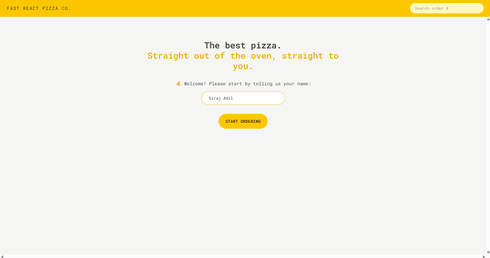
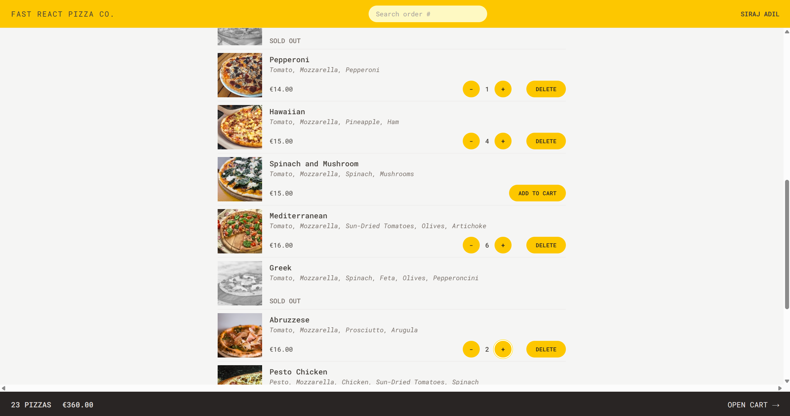
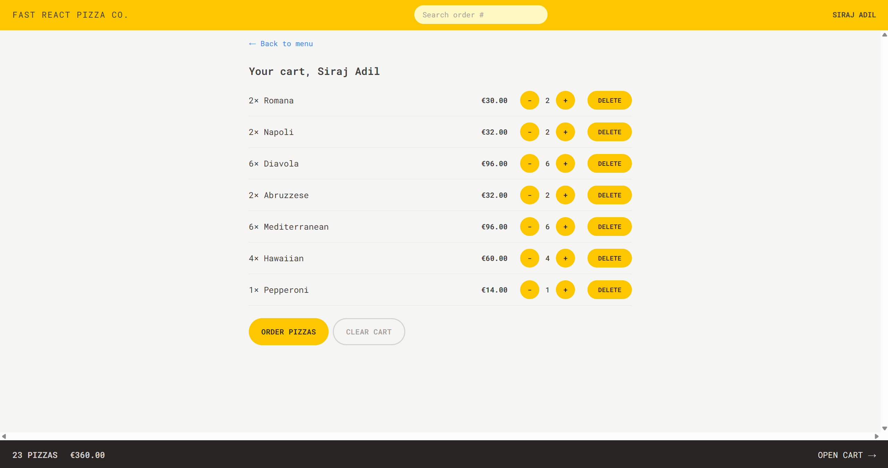
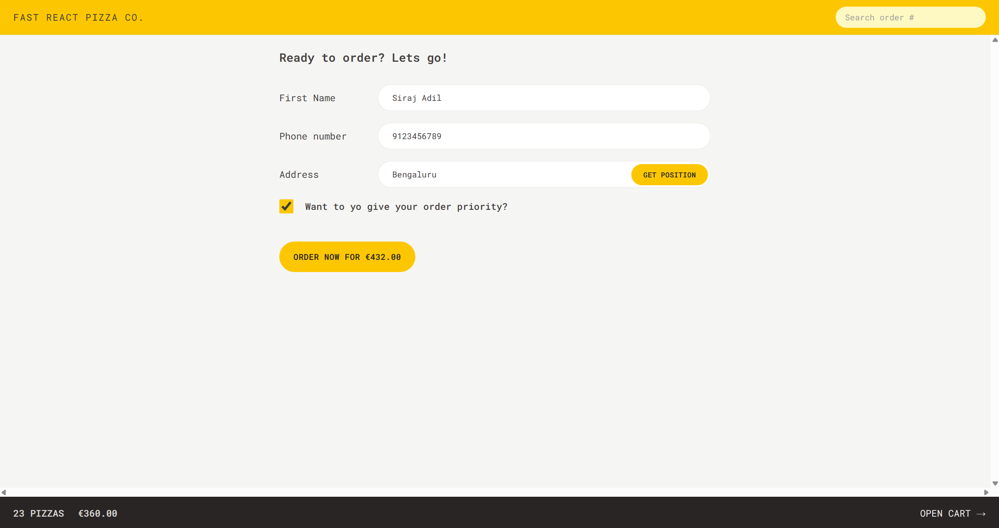
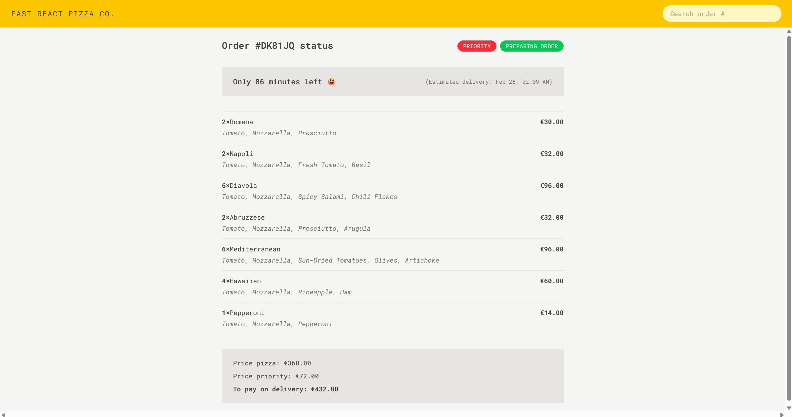

# Fast-React-Pizza

A modern React application for a pizza ordering interface, built with **React 18**, **Vite**, **Redux Toolkit**, and **TailwindCSS**. This project is designed to be fast, responsive, and fully type-safe with TypeScript types support.

---

## 🚀 Features

- **React 18** with functional components and hooks
- **Redux Toolkit** for state management
- **React Router DOM v7** for client-side routing
- **TailwindCSS v4** for fast styling
- **ESLint & Prettier** for consistent code style
- **Vite** for lightning-fast development and build

---

## Setup Instructions

1. Clone the repo:
```bash
git clone https://github.com/Siraj-Adil/FastReactPizza.git
cd FastReactPizza
```

2. Install dependencies:
```bash
npm install
```

3. Run the development server:
```bash
npm run dev
```

Then open [http://localhost:5173](http://localhost:5173) to view it.

---

## 🖼 Screenshots

### Home Page


### Menu Page


### Cart Page


### Order Page


### Order Status Page


Created by **Siraj Adil**